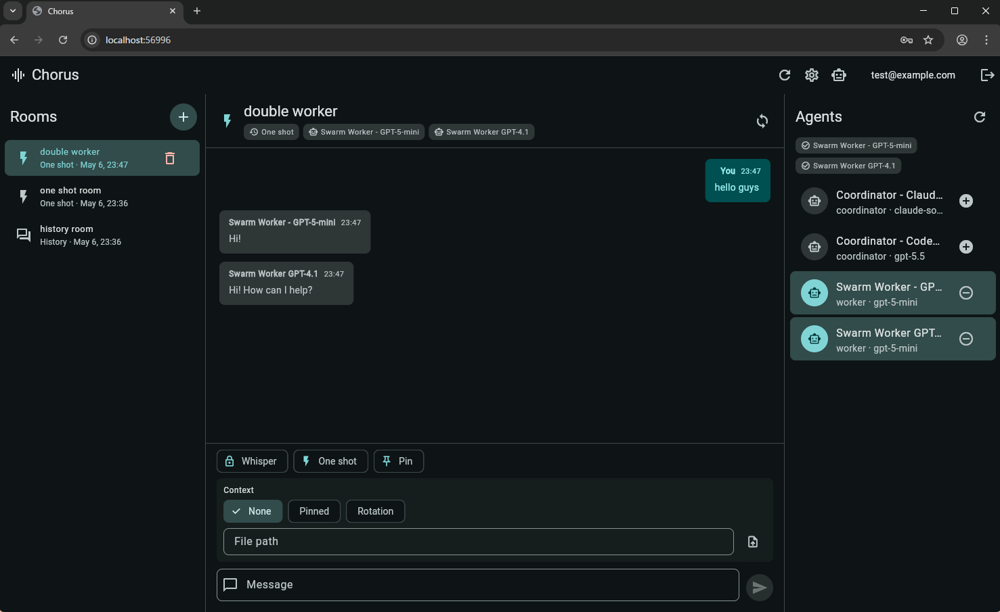

# Chorus

A real-time chat and task management platform built with Flutter and FastAPI, enabling seamless collaboration and agent-based workflow automation.

## Preview



## Features

- **Authentication & Security**: User registration, login, and two-factor authentication (2FA)
- **Real-time Chat**: WebSocket-based instant messaging between users
- **Agent Management**: Built-in agent system for task automation and workflow coordination
- **Task Routing**: Intelligent task distribution and management system
- **File Management**: File upload and download capabilities
- **Push Notifications**: Real-time push notifications for user engagement
- **Multi-database Support**: Compatible with MySQL, PostgreSQL, and SQLite
- **User Settings**: Customizable user preferences and configuration

## Tech Stack

### Server
- **Framework**: FastAPI (Python)
- **Database**: MySQL, PostgreSQL, or SQLite
- **Authentication**: JWT-based with 2FA support
- **Real-time Communication**: WebSocket

### Client
- **Framework**: Flutter
- **Target Platforms**: Web, iOS, Android

## Getting Started

### Prerequisites

- Python 3.8+
- Flutter SDK
- Node.js (for development tools)

### Server Setup

1. **Install dependencies**:
   ```bash
   pip install -r requirements.txt
   ```

2. **Configure environment variables**:
   Copy `.env.sample` to `.env` and update values as needed:
   ```bash
   cp server/.env.sample server/.env
   ```
   
   The `.env` file should contain:
   ```
   ALLOWED_ORIGIN=http://localhost:3000
   SECRET_KEY=your-secret-key-here
   ACCESS_TOKEN_EXPIRE_MINUTES=30
   CONTEXT=development
   DB_TYPE=sqlite
   DB_PATH=./chorus.db
   ```

3. **Run migrations** (if using database):
   ```bash
   # Run database initialization and migrations
   python server/startup.py
   ```

4. **Start the server**:
   ```bash
   python server/dev.py
   # or for production
   uvicorn server.app:app --host 0.0.0.0 --port 8000
   ```

   The API will be available at `http://localhost:8000`

5. **Create a dev user**:
    ```bash
    python server/create_dev_user.py
    ```
    
    This creates a default user (`dev1@chorus.local` with password `devpass123`). You can also:
    ```bash
    python server/create_dev_user.py --count 5              # Create 5 users
    python server/create_dev_user.py --list                 # List all users
    python server/create_dev_user.py --delete dev1@chorus.local  # Delete a user
    ```

### Client Setup

1. **Install dependencies**:
   ```powershell
   cd client
   flutter pub get
   ```

2. **Run the client**:
   ```powershell
   flutter run -d chrome --dart-define=CHORUS_API_BASE_URL=http://localhost:8000/chorus
   ```

   For other platforms:
   ```powershell
   flutter run -d windows
   flutter run -d ios
   flutter run -d android
   ```

   **Note**: The default API base URL is `http://localhost:8000/chorus`. Adjust the URL based on your server configuration.

## Project Structure

```
Chorus/
├── server/                    # FastAPI backend
│   ├── routers/              # API endpoint definitions
│   ├── schemas/              # Pydantic data models
│   ├── modules/              # Core business logic
│   ├── util/                 # Utility functions
│   ├── app.py                # FastAPI application
│   ├── config.py             # Configuration settings
│   └── dev.py                # Development server
├── client/                    # Flutter frontend
│   └── lib/                  # Flutter source code
└── README.md                 # Project documentation
```

## API Endpoints

### Authentication
- `POST /auth/register` - User registration
- `POST /auth/login` - User login
- `POST /auth/logout` - User logout
- `POST /token/refresh` - Refresh access token

### Chat
- `WS /ws` - WebSocket connection for real-time chat
- `GET /chat` - Fetch chat history
- `POST /chat` - Send chat message

### Agent
- `GET /agent` - List available agents
- `POST /agent` - Create new agent

### Routing
- `GET /routing` - Get routing configuration
- `POST /routing` - Set routing rules

### User Settings
- `GET /settings` - Get user settings
- `PUT /settings` - Update user settings

## Configuration

### Environment Variables

See `server/.env.sample` for a complete example of all required environment variables.

| Variable | Description | Default |
|----------|-------------|---------|
| `ALLOWED_ORIGIN` | CORS allowed origin | * |
| `SECRET_KEY` | JWT secret key | your-secret-key-here |
| `ACCESS_TOKEN_EXPIRE_MINUTES` | Token expiration time | 30 |
| `CONTEXT` | Execution context (project path) | /chorus |
| `DB_TYPE` | Database type (sqlite3/mysql/postgres) | sqlite3 |
| `DB_PATH` | Database path (sqlite) | chorus.db |
| `DB_HOST` | Database host (mysql/postgres) | 127.0.0.1 |
| `DB_PORT` | Database port (mysql/postgres) | 0 |
| `DB_USER` | Database username (mysql/postgres) | |
| `DB_PASSWORD` | Database password (mysql/postgres) | |
| `DB_DATABASE` | Database name (mysql/postgres) | |
| `DB_SCHEMA` | Database schema | |
| `RATE_LIMIT_DEFAULT` | Default rate limit | 100/hour |
| `RATE_LIMIT_LOGIN` | Login rate limit | 5/minute |
| `RATE_LIMIT_UPLOAD` | Upload rate limit | 120/minute |
| `RATE_LIMIT_DOWNLOAD` | Download rate limit | 120/minute |
| `REDIS_HOST` | Redis server host | localhost |
| `REDIS_PORT` | Redis server port | 6379 |
| `REDIS_DB` | Redis database number | 0 |

## Contributing

Contributions are welcome! Please feel free to submit a Pull Request.

## License

This project is licensed under the MIT License. See [LICENSE](LICENSE) for details.

## Support

For issues, questions, or feedback, please open an issue on GitHub.
